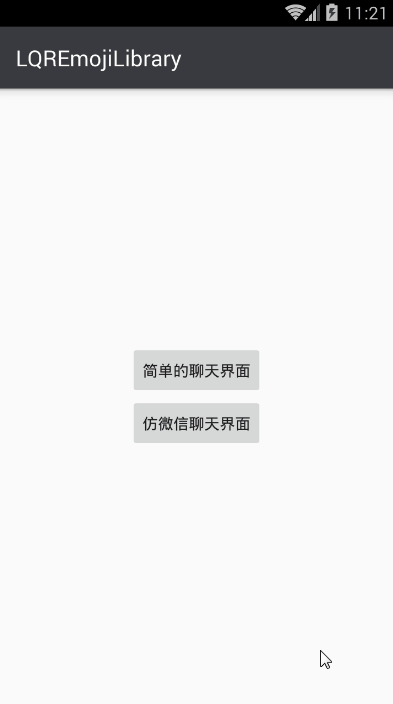
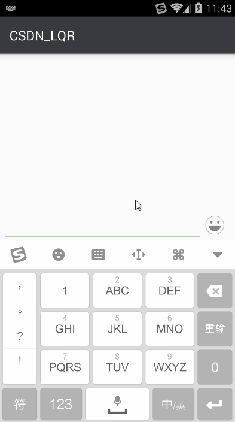
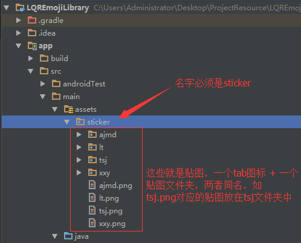
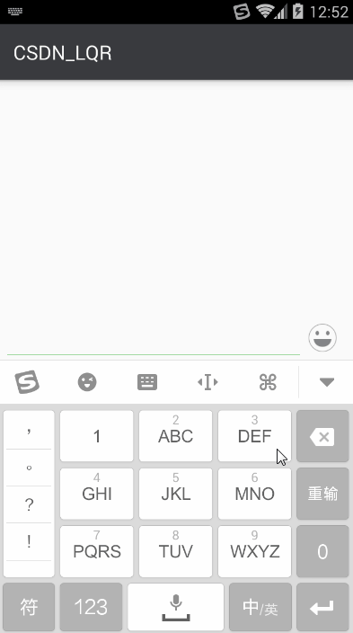
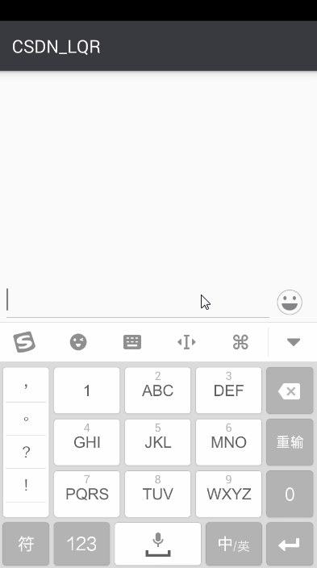

####别人写的，拿来看看，放在自己的库里，喜欢的也可以从我这里拿去。别忘了感谢作者哦~
# LQREmojiLibrary
一个超级牛逼的表情库，可使用表情及贴图功能，方便好用，抽离图片加载接口，图片加载工具可让开发者自己选择。

##一、简述

这个库相当牛逼，好用。这个库相当牛逼，好用。这个库相当牛逼，好用。好了，接下来直接看效果图吧：

[DemoApp下载](app-release.apk)

##二、引用初始化

###1、在自己项目中添加本项目依赖：

	compile 'com.lqr.emoji:library:1.0.0'

###2、初始化

使用本库必须在自定义的Application中使用LQREmotionKit对库进行初始化，LQREmotionKit提供了四种初始化方法，请根据自己的需要选择。

***使用前需要注意以下几点：**

1. 本库抽离出了图片加载接口，可让开发者自己选择图片加载工具（如：Glide、UIL等），所以使用本库必须实现IImageLoader接口。
2. 本库支持设置贴图的存放路径，这意味着开发者可以根据自己项目需求修改贴图的存放位置，并且支持贴图自定义。默认的贴图存放在/data/data/包名/files/stickers 目录下。

####1)不带IImageLoader的init()

	public static void init(Context context)
	
	public static void init(Context context, String stickerPath)

####2)带IImageLoader的init()

	public static void init(Context context, IImageLoader imageLoader)
	
	public static void init(Context context, String stickerPath, IImageLoader imageLoader)

####3)示例

	public class App extends Application {
	
	    @Override
	    public void onCreate() {
	        super.onCreate();
	        LQREmotionKit.init(this, new IImageLoader() {
	            @Override
	            public void displayImage(Context context, String path, ImageView imageView) {
	                Glide.with(context).load(path).centerCrop().diskCacheStrategy(DiskCacheStrategy.SOURCE).into(imageView);
	            }
	        });
	    }
	}

##三、表情功能集成

###1、布局中使用EmotionLayout控件

	<?xml version="1.0" encoding="utf-8"?>
	<LinearLayout xmlns:android="http://schemas.android.com/apk/res/android"
	              android:layout_width="match_parent"
	              android:layout_height="match_parent"
	              android:orientation="vertical">
	
	    <!--内容区-->
	    <LinearLayout
	        android:id="@+id/llContent"
	        android:layout_width="match_parent"
	        android:layout_height="0dp"
	        android:layout_weight="1"
	        android:orientation="vertical">
	
	        ...
			这里一般是放消息列表，和内容输入框等控件
			...

	    </LinearLayout>
	
	    <!--表情区-->
	    <com.lqr.emoji.EmotionLayout
	        android:id="@+id/elEmotion"
	        android:layout_width="match_parent"
	        android:layout_height="270dp"
	        android:visibility="gone"/>
	
	</LinearLayout>

###2、实现输入框图文混排

####1)将内容输入框交给EmotionLayout管理（强烈建议!!!）

	mElEmotion.attachEditText(mEtContent);

####2)实现IEmotionSelectedListener接口，手动实现图文混排(有自己的实现方式的，可以采用这种方式)

	mElEmotion.setEmotionSelectedListener(new IEmotionSelectedListener() {
        @Override
        public void onEmojiSelected(String key) {
            if (mEtContent == null)
                return;
            Editable editable = mEtContent.getText();
            if (key.equals("/DEL")) {
                mEtContent.dispatchKeyEvent(new KeyEvent(KeyEvent.ACTION_DOWN, KeyEvent.KEYCODE_DEL));
            } else {
                int start = mEtContent.getSelectionStart();
                int end = mEtContent.getSelectionEnd();
                start = (start < 0 ? 0 : start);
                end = (start < 0 ? 0 : end);
                editable.replace(start, end, key);

                int editEnd = mEtContent.getSelectionEnd();
                MoonUtils.replaceEmoticons(LQREmotionKit.getContext(), editable, 0, editable.toString().length());
                mEtContent.setSelection(editEnd);
            }
        }

        @Override
        public void onStickerSelected(String categoryName, String stickerName, String stickerBitmapPath) {

        }
    });

###3、实现内容区与表情区仿微信切换效果

	private EmotionKeyboard mEmotionKeyboard;

	private void initEmotionKeyboard() {
        mEmotionKeyboard = EmotionKeyboard.with(this);
        mEmotionKeyboard.bindToContent(mLlContent);
        mEmotionKeyboard.bindToEmotionButton(mIvEmo);
        mEmotionKeyboard.bindToEditText(mEtContent);
        mEmotionKeyboard.setEmotionLayout(mElEmotion);
    }

###4、效果

经过上面几步，就可以实现以下效果了：

##四、贴图功能集成

###1、设置贴图的存放位置

这一步可略过，不设置的话，贴图的默认存放位置是 /data/data/包名/files/stickers ，可通过LQREmotionKit.getStickerPath()获得。

贴图的存放位置只能通过LQREmotionKit的init()来设置：

	LQREmotionKit.init(this, Environment.getExternalStorageDirectory().getAbsolutePath()+ File.separator+"sticker");

	LQREmotionKit.init(this, Environment.getExternalStorageDirectory().getAbsolutePath() + File.separator + "sticker", new IImageLoader() {
            @Override
            public void displayImage(Context context, String path, ImageView imageView) {
                Glide.with(context).load(path).centerCrop().diskCacheStrategy(DiskCacheStrategy.SOURCE).into(imageView);
            }
        });

###2、将贴图下载到指定贴图的存放位置

####1)自带贴图

本库支持 集成默认贴图，可将贴图按规则放置在assets的sticker目录下，当程序启动时，会自动将assets的sticker目录下所有的贴图复制到贴图的存放位置。

####2)网络下载贴图

	//得到贴图的存放位置
	String stickerPath = LQREmotionKit.getStickerPath();
	...
	网络下载（这里不同项目实现方式不同，请根据自己的项目实现该部分代码）
	...

###3、监听用户点击贴图事件

	mElEmotion.setEmotionSelectedListener(new IEmotionSelectedListener() {
        @Override
        public void onEmojiSelected(String key) {
            
        }

        @Override
        public void onStickerSelected(String categoryName, String stickerName, String stickerBitmapPath) {
            String stickerPath = stickerBitmapPath;
            ...
			发送图片
			...
        }
    });

###4、效果

经过上面几步，就可以实现以下效果了：

##五、拓展按钮的控制

###1、设置表情控件的拓展按钮

默认表情控件的底部Tab是不显示“添加”按钮和“设置”按钮的，如果需要，可通过以下代码进行控制。

	mElEmotion.setEmotionAddVisiable(true);
    mElEmotion.setEmotionSettingVisiable(true);
    mElEmotion.setEmotionExtClickListener(new IEmotionExtClickListener() {
        @Override
        public void onEmotionAddClick(View view) {
            Toast.makeText(getApplicationContext(), "add", Toast.LENGTH_SHORT).show();
        }

        @Override
        public void onEmotionSettingClick(View view) {
            Toast.makeText(getApplicationContext(), "setting", Toast.LENGTH_SHORT).show();
        }
    });

###2、效果

